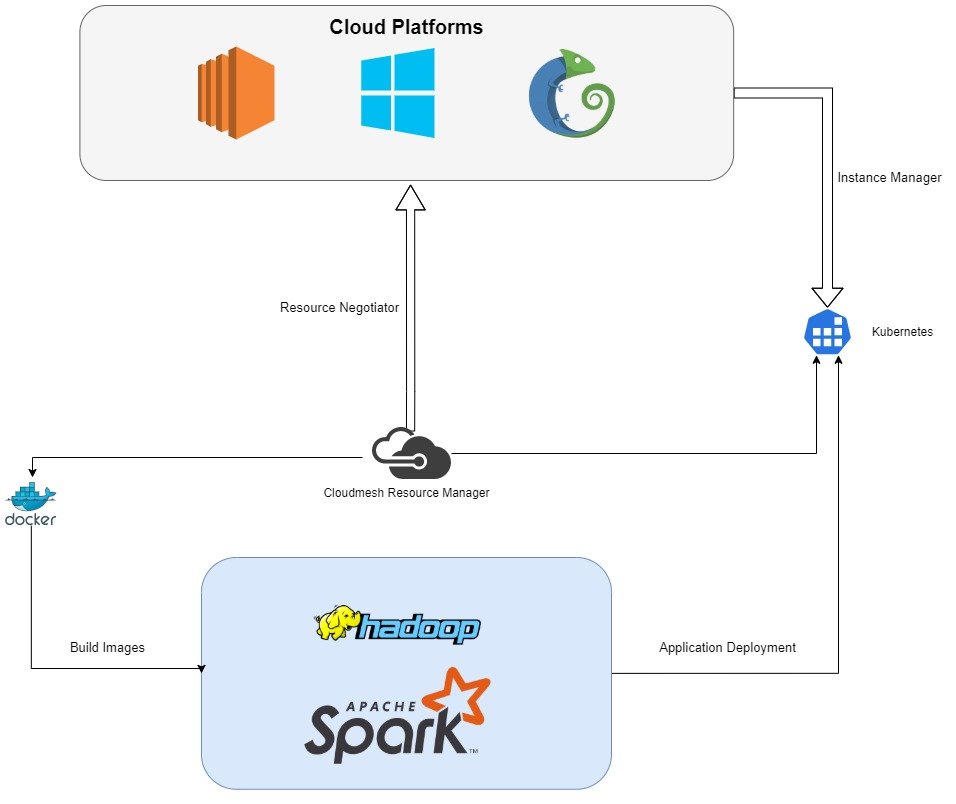

# Spark Cluster Management Abstraction Layer
* Anish Mirjankar [fa19-516-153](https://github.com/cloudmesh-community/fa19-516-153)
* Siddhesh Mirjankar [fa19-516-164](https://github.com/cloudmesh-community/fa19-516-164)
* Gregor von Laszewski
* [Insights](https://github.com/cloudmesh-community/fa19-516-153/graphs/contributors)

The following repositories contain the code in this project.
* [cloudmesh/cloudmesh-cluster](https://github.com/cloudmesh/cloudmesh-cluster)
* [cloudmesh/cloudmesh-spark](https://github.com/cloudmesh/cloudmesh-spark)
* [cloudmesh/cloudmesh-hadoop](https://github.com/cloudmesh/cloudmesh-hadoop)
* [cloudmes/cloudmesh-k8](https://github.com/cloudmesh/cloudmesh-k8)

## Introduction
In various enterprise data pipelines, there is a lack of multi-cloud architecture, often due to cloud platforms offering easy-to-use products such as [AWS Elastic MapReduce](https://aws.amazon.com/emr/), [Azure HDInsight](https://azure.microsoft.com/en-us/services/hdinsight/), [Google Dataproc](https://cloud.google.com/dataproc/), or [Oracle Big Data Cloud Service](https://www.oracle.com/big-data/big-data-cloud-service/). Businesses suffer from the lack of the ability to deploy applications to clusters that encompass several cloud platforms and on-premises storage/compute.  These data pipelines can benefit from a provider-agnostic solution that will encompass all their available options, rather than forcing them to choose a cloud platform over another. This can be especially beneficial to data teams that require dynamic storage solutions and want the flexibility to move between cloud platforms with ease. Our solution will integrate a flexible cloud cluster service into the resource management services provided by [Cloudmesh](https://cloudmesh-community.github.io/), in order to provide teams with a better resource with which to easily deploy clusters.

     
*[Source](https://github.com/cloudmesh-community/fa19-516-153/blob/master/project/diagram.jpg)*

## Progress/Benchmarking
Our team prototyped our product using a combination of Docker and Nomad on OpenStack to orchestrate clusters and deploy applications.  Cloudmesh was used to manage cloud instances, build images, and automate the deployment cycle.  Nomad was initially used due to its ease of use for prototyping and general-purpose application deployment ([source](https://www.hashicorp.com/resources/hashicorp-nomad-vs-kubernetes-comparing-complexity)). Nomad was rejected due to the superiority of the Kubernetes technology stack, which provided a quicker deployment and more effective job management.  Our team is currently working on integrating [Parameterized Stanzas](https://www.nomadproject.io/docs/job-specification/parameterized.html) into the Cloudmesh Kubernetes Deployment in order to complete the replacement of Nomad in our project.

Our team is additionally working on the following cloudmesh commands in order to automate the deployment and requesting of instances based on available resources:
```bash
cluster create -n NAME -p PROVIDER [HOSTNAMES]
cluster add -n NAME HOSTNAME
cluster remove -n NAME HOSTNAME
cluster kill -n NAME
cluster info -n NAME 
cluster submit -n NAME JOB
cluster list
```
*[Source](https://github.com/cloudmesh-community/fa19-516-153/tree/master/project/cloudmesh/cluster/command/cluster.py)*

## Deploying a Kubernetes Cluster using Cloudmesh
The following capabilities of Cloudmesh were used to provision instances and deploy Kubernetes to [AWS](https://aws.amazon.com/), [Azure](https://azure.microsoft.com/), and [OpenStack](https://www.chameleoncloud.org/):
* [cloudmesh-cloud](https://github.com/cloudmesh/cloudmesh-cloud): Resource provisioning, cloud access
* [cloudmesh-inventory](https://github.com/cloudmesh/cloudmesh-inventory): Resource management, access & security
* [cloudmesh-cluster](https://github.com/cloudmesh/cloudmesh-cluster): Cluster deployment, images

### How to deploy a Kubernetes Cluster?

Step 1: Use a Unix-based CLI to enter the directory [cloudmesh_hadoop](https://github.com/cloudmesh-community/fa19-516-153/tree/master/project/cloudmesh/images/kubernetes/cloudmesh_hadoop). 

Step 2: Clean up docker artifacts.

```bash
make clean
```

Step 3: Initiate the build process in the
[Makefile](https://github.com/cloudmesh-community/fa19-516-153/tree/master/project/cloudmesh/images/kubernetes/cloudmesh_hadoop/Makefile).

```bash
make build
```

Step 4: Run docker-compose to aggregate the output of all the
dockerfiles.

```bash
docker-compose up
```


Step 5: Run all the run commands in the
[Makefile](https://github.com/cloudmesh-community/fa19-516-153/tree/master/project/cloudmesh/images/kubernetes/cloudmesh_hadoop/Makefile)

```bash
make run
```

Step 6: Deploy a Kubernetes Cluster

```bash
docker stack deploy --orchestrator kubernetes -c docker-compose.yml cloudmesh_hadoop
```

Step 7: Remove the Kubernetes Cluster

```bash
docker stack rm cloudmesh_hadoop
```


## Deploying Hadoop on Kubernetes using Cloudmesh
-------
*Old revision, please refer only to content above*

## Introduction

In various enterprise data pipelines, there is a lack of multi-cloud
architecture, often due to services like Spark being natively integrated
into clusters such as AWS Elastic MapReduce [REFMISISNG], Azure
[REFMISISNG], Google [REFMISISNG], or Oracle [REFMISISNG], as well as
locally managed traditional clusters.  These data pipelines can benefit
from a provider-agnostic solution that will encompass all their
available options, rather than forcing them to choose a cloud platform
over another.  This can be especially beneficial to data teams that
require dynamic storage solutions and want the flexibility to move
between cloud platforms with ease. We will leverage the convenient
multi-cloud interfaces provided by Cloudmesh [REFMISISNG].
      
:o2: it is unclear why the use of native cluster is bad ... maybe it is
not bad, but its good. maybe its just another way ... Motivation for
project not yet fully clarified.


## Cloudmesh

We use cloudmesh whic provides the following benefical features:

* Support for multicloud VM management on AWS, Azure, Google. Oracle,
  OpenStack. 
* Support for containers just the same way VMs are supported
  (this has not been leveraged yet in this activity).
* Support for bookkeeping VM's and containers in a database 
* Support for bookkeeping of an inventory of services
* ability to distribute a default configuration file that allows easy 
  authentication and selection of default images and VM sizes
* Availability of a sophisticated command shell with plugins allowing 
  us to add solution specific commands in minutes

Together these features provide a very easy integration solution for
deploying any cluster. However, we will focus here on the deployment of
hadoop and spark clusters. The result will be an easy to use command:

```bash
$ cms cluster --name=mycluster --deploy=host[01-10] --service=hadoop
$ cms cluster --name=mycluster --deploy=host[01-10] --service=hadoop
```

To start jobs on such a cluster we do it with 

```bash
$ cms cluster --name=mycluster --job=wordcount.jar
```

As we use standrad ssh protocoll, we can inspect and fetch data from a host with

```bash
$ cms cluster --name=mycluster get /fileonhost /fileonlocal
$ cms cluster --name=mycluster put /fileonlocal /fileonhost
```

These commands are easy to implement due to the availability of the
database and the `cms host` command


## Implementation

### Cluster Abstrations

#### Inventory

:o2: describe

#### Cluster Dict

to represent a cluster in the databbase we simply add the inventory to
the cloudmesh database. They are stored in the collection
`local-cluster`. Cloudmesh has a sophisticated easy to use interface to
MongoDB allowing augmented functions with a decorator to write into the
database as long as they return a dict and contain a `cm` dict
specifying its uniqueness and name. For our cluster we define it as 

```
"cm" : {
    "kind" : "secgroup",
    "name" : "mycluster",
    "cloud" : "local", # the cluster service runs locally 
                       # in futer version we will rename cloud to 
                       # either service or location
                       # on which cloud the node runs is specified
                       # within each node. 
    "collection" : "local-secgroup",
    "created" : "2019-12-18 19:57:22.052384",
    "modified" : "2019-12-18 19:57:22.052384"
}
"name" : "mycluster",
"inventory": .... # details from inventory 
```

We implement a class that allows easy access to this functionality as an API

class Cluster:

        
    def list(name=name):
        return dict  
        
    @DatabbaseUpdate
    def add(name=name, spec=inventory_spec):
        return dict    

    @DatabbaseUpdate
    def delete(name=name):
        return dict    

    @DatabbaseUpdate
    def status(name=name):
        return dict    
        
    @DatabbaseUpdate
    def deploy(name=name, spec=deploy_spec):
        return dict    

    @DatabbaseUpdate
    def run(name=name, spec=run_spec):
        return dict    

This API can than be used in a cloudmesh Plugin command to make the
functionality available from the command line.


## Proposal :o2: we are long past the proposal stage

We will be exploring options for an implementation of Apache Spark that
can be managed remotely from a multi-cloud orchestration service.  We
will abstract the storage and compute initalization within Spark to run
parameterized jobs from this service.  This will allow the performance
bottlenecks of high-performance data transfer to be contained within the
cluster itself, rather than a data source.


## Action

In order to solve this problem, we will be using cloudmesh to coordinate the
the vm management on which we install the clusters. This is facilitated also 
by the following commands available in cloudmesh:

* `cms vm boot`
* `cms inventory`
* `cms host`

In addition we leverage docker images developed by bde2020 ...

    TODO write if you deverge from them, looks like you need more explanations

 
 The kubernetes image Dockefiles are available in the 
[Repository](https://github.com/cloudmesh-community/fa19-516-153/tree/master/project/cloudmesh/images/kubernetes/Kubernetes.md)
cluster, and generating a standalone Spark image that will run
parameterized jobs, utilizing all of the available multi-cloud options
available to the orchestator as well as all of the compute instances. 
We will also be implementing a testing service that will provide the
cluster with the access to compute resources and storage that the jobs
will need to run.

:o2: at no time was mentioned that the images are copied from bde2020 in
the report which is not good as that would be plagiarizm if you do not
mention it.


## Solution

The solution is composed of the following workflow:

1. creating a cluster with cloudmesh 
2. interacting with the cluster with the existing inventory the host and
   the vm commands (and improving them if they do miss features)
3. Deploying Hadoop and/or Spark on the cluster
4. Starting hadoop or spark jobs on the cluster
5. Retrieving results form the jobs

jobs to the cluster. To make it more convenient for the user, we will
integrate this workflow into a convenient cloudmesh command. This
command will replace the prior work that was conducted in cloudmesh BDRA
that deployed hadoop and spark with ansible scripts. 
**i forgot the link ... we need to find them in the repos** 


The command will be called `cms cluster` and has the following manual page:

TBD


## Progress

:o2: please remove this progress section and instead focus on the report
writing. For example the report of the first item in your progress is
unclear and not even needed for this project. Please drop the use of
nomad. Cloudmesh can do this and has been doing thsi before nomad even
existed.


* Successfully deployed a Hadoop using a Nomad Cluster 

  :o2: if nomad deploys hadoop or just a cluster, please explain, your
  report is to vague and thus proper feedback is impossible.
   
* Integrated the deployment with Cloudmesh. Automation is left.

  :o: if you use cloudmesh i do not see why you need nomad.
  
* Successfully deployed a Hadoop using a Kubernetes Cluster
* Need to integrate and automate the deployment with Cloudmesh

:o2: please review the host command in cloudmesh-inventory. Ideally we
should merge the commands. The reason I could not see what you did is
that you did not use proper markdown, so all your links did not work.
Thus instead of calling the command in inventory cluster I called it
host to simplify the merging. Please remember that merging is part of
this review process. We need that functionality only once.

:o2: the previous comment indicates to me that we discussed the use of
nomad before. I also recal that we several times mentioned that we
shoudl start vms with cloudmesh and use inventory to manage the nodes.

The following commands will be integrated into the cloudmesh service:

```
cluster create -n NAME -p PROVIDER [HOSTNAMES]
cluster add -n NAME HOSTNAME
cluster remove -n NAME HOSTNAME

# only cloudmesh - bring every machine involved in server down
cluster kill -n NAME 

cluster info # find all clusters

# find info about given cluster (query the address for 
# either kubernetes or nomad)
cluster info -n NAME 
cluster submit -n NAME JOB
cluster list
```

[Source](https://github.com/cloudmesh-community/fa19-516-153/tree/master/project/cloudmesh/cluster/command/cluster.py)


### Interaction

We are interacting with the nomad and kubernetes REST APIs to
dynamically modify and interact with the cluster/agent configurations
while jobs are running.  For each interaction, cloudmesh queries the
appropriate provider's API to perform the action to avoid managing a
local state.


### Initialization

Using this mechanism, cloudmesh will be able to simultaneously
initialize and prepare machines in a cluster while building and
deploying the images. The initialization and preparation steps will
submit the requested shell script to each machine added to the cluster:

* [Kubernetes](https://github.com/cloudmesh-community/fa19-516-153/tree/master/project/cloudmesh/images/kubernetes/build.sh)
* [Nomad](https://github.com/cloudmesh-community/fa19-516-153/tree/master/project/cloudmesh/images/nomad/build.sh)

We are using the Hadoop Distributed File System (HDFS) of Hadoop v3.2.1
to build docker images of the HDFS services namely Namenode, Datanode,
Nodemanager and Resourcemanager. The following are the Dockerfiles for
each HDFS service.

* [Dockerfile for building a Hadoop Image](https://github.com/cloudmesh-community/fa19-516-153/tree/master/project/cloudmesh/images/kubernetes/cloudmesh_hadoop/base/Dockerfile) <br/>

* [Dockerfile for Namenode](https://github.com/cloudmesh-community/fa19-516-153/tree/master/project/cloudmesh/images/kubernetes/cloudmesh_hadoop/namenode/Dockerfile) <br/>
* [Shell Script to run Namenode](https://github.com/cloudmesh-community/fa19-516-153/tree/master/project/cloudmesh/images/kubernetes/cloudmesh_hadoop/namenode/run.sh) <br/>

* [Dockerfile for Datanode](https://github.com/cloudmesh-community/fa19-516-153/tree/master/project/cloudmesh/images/kubernetes/cloudmesh_hadoop/datanode/Dockerfile) <br/>
* [Shell Script to run Datanode](https://github.com/cloudmesh-community/fa19-516-153/tree/master/project/cloudmesh/images/kubernetes/cloudmesh_hadoop/datanode/run.sh) <br/>

* [Dockerfile for Nodemanager](https://github.com/cloudmesh-community/fa19-516-153/tree/master/project/cloudmesh/images/kubernetes/cloudmesh_hadoop/nodemanager/Dockerfile) <br/>
* [Shell Script to run Nodemanager](https://github.com/cloudmesh-community/fa19-516-153/tree/master/project/cloudmesh/images/kubernetes/cloudmesh_hadoop/nodemanager/run.sh) <br/>

* [Dockerfile for Resourcemanager](https://github.com/cloudmesh-community/fa19-516-153/tree/master/project/cloudmesh/images/kubernetes/cloudmesh_hadoop/resourcemanager/Dockerfile) <br/>
* [Shell Script to run Resourcemanager](https://github.com/cloudmesh-community/fa19-516-153/tree/master/project/cloudmesh/images/kubernetes/cloudmesh_hadoop/resourcemanager/run.sh) <br/>

* [Dockerfile for Historyserver](https://github.com/cloudmesh-community/fa19-516-153/tree/master/project/cloudmesh/images/kubernetes/cloudmesh_hadoop/historyserver/Dockerfile) <br/>
* [Shell Script to run Historyserver](https://github.com/cloudmesh-community/fa19-516-153/tree/master/project/cloudmesh/images/kubernetes/cloudmesh_hadoop/historyserver/run.sh) <br/>

### Deployment

When submitting a job to each of these providers, cloudmesh will first
build the requested image:

* [Hadoop](https://github.com/cloudmesh-community/fa19-516-153/tree/master/project/cloudmesh/images/kubernetes/cloudmesh_hadoop/base/Dockerfile)
* Spark - __TODO__
* [Cloudmesh](https://github.com/cloudmesh-community/fa19-516-153/tree/master/project/cloudmesh/images/cloudmesh/Dockerfile) - if a remote instance is needed

And submit the jobfile to the cluster using the provider's REST API.


### How to deploy a Kubernetes Cluster?

Step 1: Make sure you are in the [cloudmesh_hadoop](https://github.com/cloudmesh-community/fa19-516-153/tree/master/project/cloudmesh/images/kubernetes/cloudmesh_hadoop)
directory and open **Gitbash**. 

Step 2: Clean up docker

```bash
make clean
```

Step 3: Run all the build commands in the
[Makefile](https://github.com/cloudmesh-community/fa19-516-153/tree/master/project/cloudmesh/images/kubernetes/cloudmesh_hadoop/Makefile)

```bash
make build
```

Step 4: Run docker-compose to aggregate the output of all the
dockerfiles.

```bash
docker-compose up
```


Step 5: Run all the run commands in the
[Makefile](https://github.com/cloudmesh-community/fa19-516-153/tree/master/project/cloudmesh/images/kubernetes/cloudmesh_hadoop/Makefile)

```bash
make run
```

Step 6: Deploy a Kubernetes Cluster

```bash
docker stack deploy --orchestrator kubernetes -c docker-compose.yml cloudmesh_hadoop
```

Step 7: Remove the Kubernetes Cluster

```bash
docker stack rm cloudmesh_hadoop
```

### Deployment with the help of Cloudmesh

The deployment of VMs in cloudmesh is a one line command:

```bash
cms vm boot host[01-10]
```

To list the vms you can use

```bash
cms vm boot host[01-10]
```

To delete the VMS you can use

```bash
cms vm delete host[01-10]
```

To run commands on the hosts you can use

```bash
cms vm ssh host[01-10] command
```

As you can see cloudmesh has a very convenient mechanism to use user
defined hostnames based on a standard configuration that is managed in a
configuration file. This abstraction is very easy to understand for users.

Worker nodes and masters can be configured by convention, for example
the first node can be the master node. If more detailes service fetures
need to be recorded they can be added with the

```bash
cloudmesh inventory
```

command which allows us to easily manage service attribute names in a
text yaml configuration file.

### Deployment with the help of Nomad

At one point we used Nomad for this project, but we have to point out
that using NOmad for this project is unnecessary as Cloudmesh provides
the ability to manage vms and can stroe them in a database and also in
an inventory file. These features have been available before Nomad was 
developed. 


However, we also experimented with Nomad. Nomad is a cluster and
resource management service primarily used for prototyping and is
currently running on the HashiCorp ecosystem (Vagrant, Consul,
Terraform, etc.) The primary use-case for nomad is quick protyping and
rapid integration of new servers into a docker-based protocol.  One
strong benefit of nomad is its job parameterization functions - allowing
images to be rapidly deployed through the API based on a minimal set of
constraints.

Nomad is designed around a single software package which is to be
installed on a Debian 9+ VM for optimal use.  [Nomad
Installation](http://github.com/cloudmesh-community/fa19-516-153/tree/master/project/cloudmesh/images/nomad/build.sh)

First, a nomad agent will be deployed:
```sh
nomad agent -dev		# for local development environment OR
nomad agent -client		# for cluster client agent OR
nomad agent -server		# for cluster server agent
```
This will ensure that nomad is running and searching for all peers in the network.

If peers do not exist in the nomad network, the user must instruct the
nomad agent to look for servers.  This can be controlled by the
`-servers` option.

```sh
nomad agent -{type} -servers "host1:port,host2:port,..."
```

 Once a nomad agent/cluster is generated, a jobfile must be deployed to
 this cluster.  This can be performed by running the command:
 
 ```sh
 nomad job run JOBFILE_PATH						# if the cluster is locally held or the NOMAD_ADDR env variable is set OR
 nomad job run -address={addr} JOBFILE_PATH		# if the cluster is remotely held
 ```

The nomad api can be easily accessed on a custom nomad port or the
default port 4646.  This api will control all machines connected to the
same cluster.


#### Deploying Hadoop to the Nomad Cluster

The Hadoop ecosystem may be deployed to a nomad cluster using
docker-based components. The following images will need to be built and
deployed to a container repository or transferred to all nomad servers.

```sh
cd ~/cloudmesh/images/hadoop
docker build -t hadoop-base ./base
docker build -t hadoop-namenode ./namenode
docker build -t hadoop-datanode ./datanode
docker build -t hadoop-resourcemanager ./resourcemanager
docker build -t hadoop-nodemanager ./nodemanager
docker build -t hadoop-historyserver ./historyserver
docker build -t hadoop-submit ./submit
```

Each image will be run in a task in the format:
```
task "{task_name}" {
	image="{image_name}"
}
```

## References

* [Kubernetes](https://kubernetes.io/docs/setup/#production-environment)
* [Nomad](https://www.nomadproject.io/guides/install/production/index.html)
* [Hadoop](https://hadoop.apache.org/docs/stable/hadoop-project-dist/hadoop-common/ClusterSetup.html)
